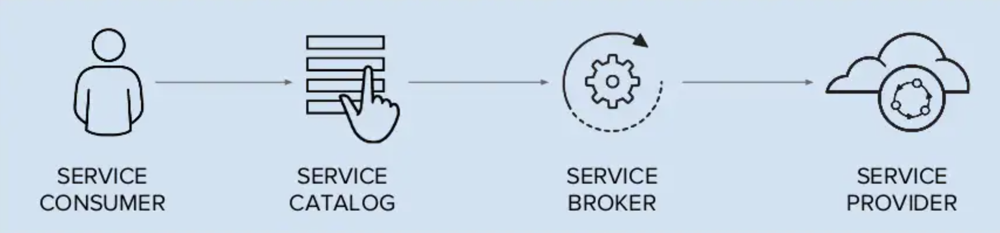
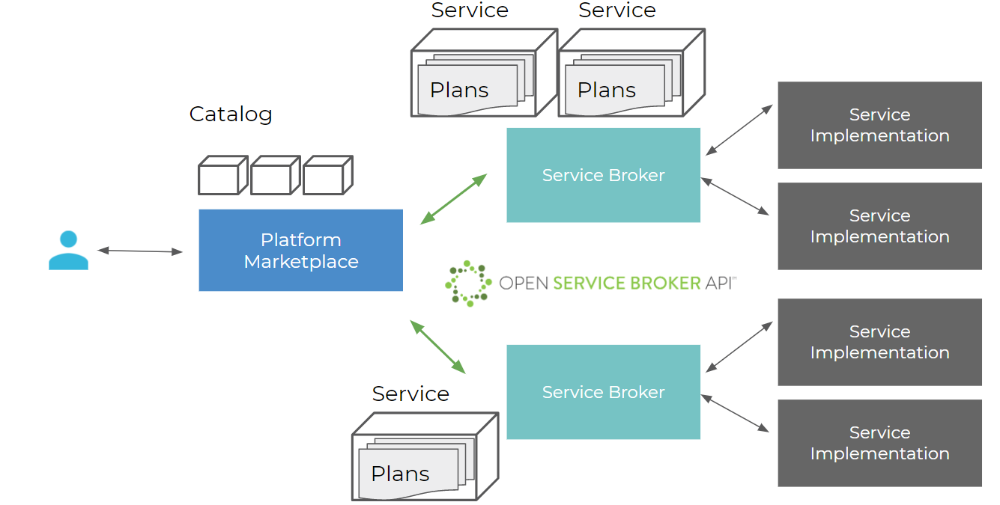

## Terminologies

Following image depicts components involved in implementation of Open Service Broker APIs

1. **Service** - A managed software offering that can be used by an Application/Maker/End-User. 

2. **Service Provider** - An entity that deals with implementation and management of `service-instance` for a service offerings.

3. **Service Consumer** -  An entity that consumes service offerings provided by service provider.

4. **Service Catalog** - The advertisement of a Service that a Service Broker supports.

5. **Service Broker** - Service Brokers manage the lifecycle of Services. Platforms interact with Service Brokers for advertising a catalog of Service Offerings and Service Plans, to provision, and manage, Service Instances and Service Bindings using Open Service Broker API specification for which a Platform is a client. 

5. **Platform** - The software that will manage the cloud environment into which Applications are provisioned and Service Brokers are registered.

6. **Service Plan** -  The representation of the costs and benefits for a given variant of the Service, potentially as a tier.

7. **Service Instance** - An instantiation of a Service Offering and Service Plan.

8. **Service Binding** - Represents the request to use a Service Instance. As part of this request there might be a reference to the entity, also known as the Application, that will use the Service Instance. Service Bindings will often contain the credentials that can then be used to communicate with the Service Instance.